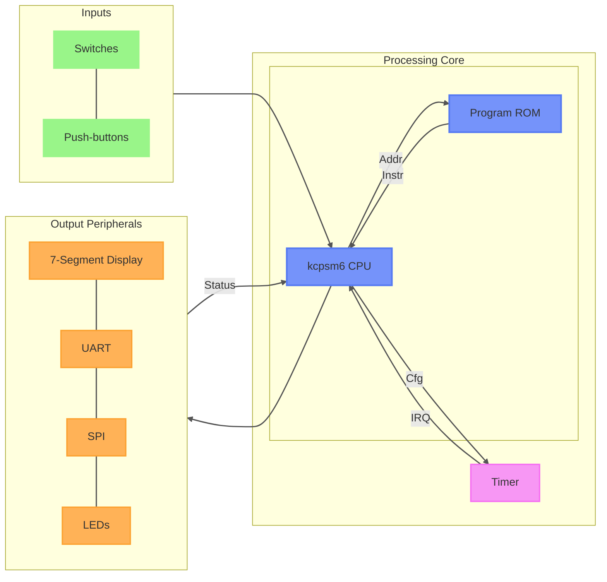

# PicoBlaze FPGA SoC
<!-- Add graph for explain state machine (spi, ...), note that it was develop at ulster for an internship -->
A small educational System-on-Chip built around the Xilinx PicoBlaze (KCPSM6) soft-core processor on the basys 3 development board.

The project demonstrates how to connect a PicoBlaze CPU to common FPGA peripherals through a memory-mapped I/O interface. It provides examples of:

* GPIO control (LEDs and switches)
* Push-button inputs with debouncing
* UART communication
* 7-segment display control
* SPI master interface
* Timer peripheral with interrupt generation

The design is intended for learning embedded systems concepts on FPGA platforms while keeping the hardware architecture simple and easy to understand.

# Architecture Overview


The PicoBlaze accesses peripherals through its standard 8-bit I/O port interface.

Each peripheral is assigned one or more port addresses.

# Repository Contents

| Module          | Description                       |
| --------------- | --------------------------------- |
| `picoblaze_top` | Top-level integration             |
| `kcpsm6`        | PicoBlaze CPU core                |
| `picoblaze_rom` | Program memory                    |
| `debouncer`     | Push-button debouncing            |
| `uart`          | UART controller                   |
| `seg7`          | 4-digit seven-segment driver      |
| `timer`         | Programmable timer with interrupt |
| `spi`           | SPI master controller             |
| `flag_buf`      | Interrupt flag latch              |

# Clock and Reset

## Clock

The entire system operates from the FPGA system clock.

## Reset Sources

The PicoBlaze reset signal is generated by:

* Center push-button (`btnC`)
* ROM reload signal (`rdl`)

```
reset = btnC_db OR rdl
```

# Interrupt System

The timer peripheral can generate interrupts.

The interrupt request is latched until acknowledged by PicoBlaze.

## Interrupt Vector
The interrupt vector is at the address `0x3FF` (ie: last address of the ROM)


# Peripheral Register Map

## Input Registers (Read)

| Port | Name         | Access | Description                |
| ---- | ------------ | ------ | -------------------------- |
| 0x00 | SW_LOW       | R      | Switches [7:0]             |
| 0x01 | SW_HIGH      | R      | Switches [15:8]            |
| 0x02 | UART_RX_DATA | R      | Received UART byte         |
| 0x03 | UART_STATUS  | R      | UART status flags          |
| 0x04 | TIM0_CNT0    | R      | Timer counter bits [7:0]   |
| 0x05 | TIM0_CNT1    | R      | Timer counter bits [15:8]  |
| 0x06 | TIM0_CNT2    | R      | Timer counter bits [23:16] |
| 0x07 | TIM0_CNT3    | R      | Timer counter bits [31:24] |
| 0x08 | SPI_STATUS   | R      | SPI status flag            |
| 0x09 | SPI_RX_DATA  | R      | Received SPI byte          |
| 0x0A | PB           | R      | Push-button state          |


## Output Registers (Write)

| Port | Name         | Access | Description                     |
| ---- | ------------ | ------ | ------------------------------- |
| 0x00 | LED_LOW      | W      | LEDs [7:0]                      |
| 0x01 | LED_HIGH     | W      | LEDs [15:8]                     |
| 0x02 | UART_TX_DATA | W      | UART transmit byte              |
| 0x03 | SEG7_LOW     | W      | Seven-segment value bits [7:0]  |
| 0x04 | SEG7_HIGH    | W      | Seven-segment value bits [13:8] |
| 0x05 | TIM0_CFG     | W      | Timer configuration register    |
| 0x06 | TIM0_PRE0    | W      | Timer preload bits [7:0]        |
| 0x07 | TIM0_PRE1    | W      | Timer preload bits [15:8]       |
| 0x08 | TIM0_PRE2    | W      | Timer preload bits [23:16]      |
| 0x09 | TIM0_PRE3    | W      | Timer preload bits [31:24]      |
| 0x0A | SPI_CONFIG   | W      | SPI configuration register      |
| 0x0B | SPI_LEN      | W      | SPI frame lenght                |
| 0x0C | SPI_TX_DATA  | W      | SPI transmit byte               |

# Register Description

## UART_STATUS (0x03)

| Bit | Name     | Access | Description        |
| --- | -------- | -------|------------------- |
| 0   | RX_EMPTY | R      | Receive FIFO empty |
| 1   | TX_FULL  | R      | Transmit FIFO full |
| 7:2 | Reserved | R      | Always 0           |

Example:

```assembly
input s0, 03[uart_status_port]
test s0, 01[RX_EMPTY_UART]
jump z, uart_data_available
```

## SPI_STATUS (0x08)

| Bit | Name     | Access | Description              |
| --- | -------- | -------|------------------------- |
| 0   | BUSY     | R      | SPI transfer in progress |
| 1   | TX_FULL  | R      | SPI TX fifo full         |
| 2   | RX_EMPTY | R      | SPI RX fifo empty        |
| 7:3 | Reserved | N/A    | Always 0                 |


## SPI_CONFIG (0x0A)

| Bit | Name     | Access | Description           |
| --- | -------- | -------|---------------------- |
| 0   | ENABLE   | W      | Start SPI transaction |
| 1   | CPOL     | W      | SPI clock polarity    |
| 2   | CPHA     | W      | SPI clock phase       |
| 7:3 | Reserved | W      | Write 0               |

### SPI Modes

| Mode | CPOL | CPHA |
| ---- | ---- | ---- |
| 0    | 0    | 0    |
| 1    | 0    | 1    |
| 2    | 1    | 0    |
| 3    | 1    | 1    |

## SPI_LEN (0x0B)

| Bit | Name     | Access | Description                    |
| --- | -------- | -------|------------------------------- |
| 4:0 | Lenght   | W      | Lenght of SPI frame (in byte)  |
| 7:5 | Reserved | N/A    | Always 0                       |

NB: The lenght is currently cap to 32 to limit the size of fifos. You can increase it in the vhdl of the spi module if necessary.

## SPI_TX_DATA (0x0C)

Write one byte to be transmitted by the SPI master.

```assembly
LOAD s0, A5
OUTPUT s0, 0C[spi_tx_port]
```

## SPI_RX_DATA (0x09)

Contains the byte received during the previous SPI transaction.

```assembly
INPUT s0, 09[spi0_rx_port]
```

## LED_LOW (0x00)

Controls LEDs [7:0].

```assembly
LOAD s0, FF
OUTPUT s0, 00[leds7_0_port]
```

## LED_HIGH (0x01)

Controls LEDs [15:8].

```assembly
LOAD s0, 55
OUTPUT s0, 01[leds15_8_port]
```

## SEG7_LOW (0x03)

Lower 8 bits of the displayed value.


## SEG7_HIGH (0x04)

Upper 6 bits of the displayed value.

The seven-segment driver displays a 14-bit binary value (max value = 9999):


# UART Configuration

Current hardware configuration:

| Parameter  | Value   |
| ---------- | ------- |
| Baudrate   | 115200  |
| Data Bits  | 8       |
| Parity     | None    |
| Stop Bits  | 1       |
| FIFO Depth | 4 bytes |


# SPI Configuration

Current hardware configuration:

| Parameter       | Value        |
| --------------- | ------------ |
| Master Mode     | Yes          |
| Data Length     | 8 bits       |
| Clock Frequency | 1 MHz        |
| CPOL            | Configurable |
| CPHA            | Configurable |

# Timer
<!-- need explain config reg -->
The timer peripheral provides:

* 32-bit free-running counter
* Interrupt generation
* Counter value readable through ports 0x04–0x07

## TIM0_CFG (0x05)

| Bit | Name     | Access | Description                    |
| --- | -------- | -------|------------------------------- |
| 0   | EN       | W      | Enable the timer               |
| 1   | INT      | W      | Enable the interruption        |
| 2   | AR       | W      | Auto relaunch the timer when it reach the preload value |
| 3   | Reserved | N/A    | Always 0 |
| 7:4 | PSC      | W      | Prescaler value. The counter clock frequency is equal to $f_{clk}/(PSC+1)$  |

## TIM0_PRE (0x06-0x09)

| Bit | Name     | Access | Description                    |
| --- | -------- | -------|------------------------------- |
| 31:0| PRE      | W      | Preload value                  |

## TIM0_CNT (0x04-0x07)

| Bit | Name     | Access | Description                    |
| --- | -------- | -------|------------------------------- |
| 31:0| CNT      | R      | Counter value                  | 

Counter layout:

| Port | Counter Bits |
| ---- | ------------ |
| 0x04 | [7:0]        |
| 0x05 | [15:8]       |
| 0x06 | [23:16]      |
| 0x07 | [31:24]      |


# GPIO

## Inputs

### Switches

| Port | Signal   |
| ---- | -------- |
| 0x00 | SW[7:0]  |
| 0x01 | SW[15:8] |

### Push-buttons (0x0A)

| Bit | Signal        |
| --- | ------------- |
| 0   | Button Right  |
| 1   | Button Left   |
| 2   | Button Down   |
| 3   | Button Up     |
| 7:4 | Always 0      |


## Outputs

### LEDs

| Port | Signal    |
| ---- | --------- |
| 0x00 | LED[7:0]  |
| 0x01 | LED[15:8] |

# Building

The project targets a Xilinx FPGA Artix-7 and uses:

* KCPSM6 PicoBlaze processor
* Basys 3 board
* Vivado 2024.2

## PSM compilation
The firmware is written in assembly and compile by the `kcpsm6.exe`, official compiler for the CPU.
The actual firmware is the program name `picoblaze_rom.psm` in the `Softwares` folder. To compile it, you need to move to this folder and type :

```shell
.\kcpsm6.exe .\picoblaze_rom.psm
```
The script will generate a file name `picoblaze_rom.vhd` from the assembly and the ROM template. This file is the vhdl description of the ROM of the projet with the program inside. To flash it into the board, you need to use it on the vivado project.

Copy/replace the `picoblaze_rom.vhd` in `picoblaze.srcs/sources_1/imports/picoblaze/Softwares` by the new one. After that you need to regenerate the bitstream on vivado to take into account the new firmware. When the compilation of the bitstream is finish, connect to the board, program the device. The program will start automatically.

# Example
<!-- explain the actual program -->

# Annexes
* [Picoblaze official page](https://www.amd.com/en/products/adaptive-socs-and-fpgas/intellectual-property/picoblaze.html)
* [Basys 3](https://digilent.com/reference/programmable-logic/basys-3/reference-manual)
* [FPGA exemple](https://blog.aku.edu.tr/ismailkoyuncu/files/2017/04/02_ebook.pdf)