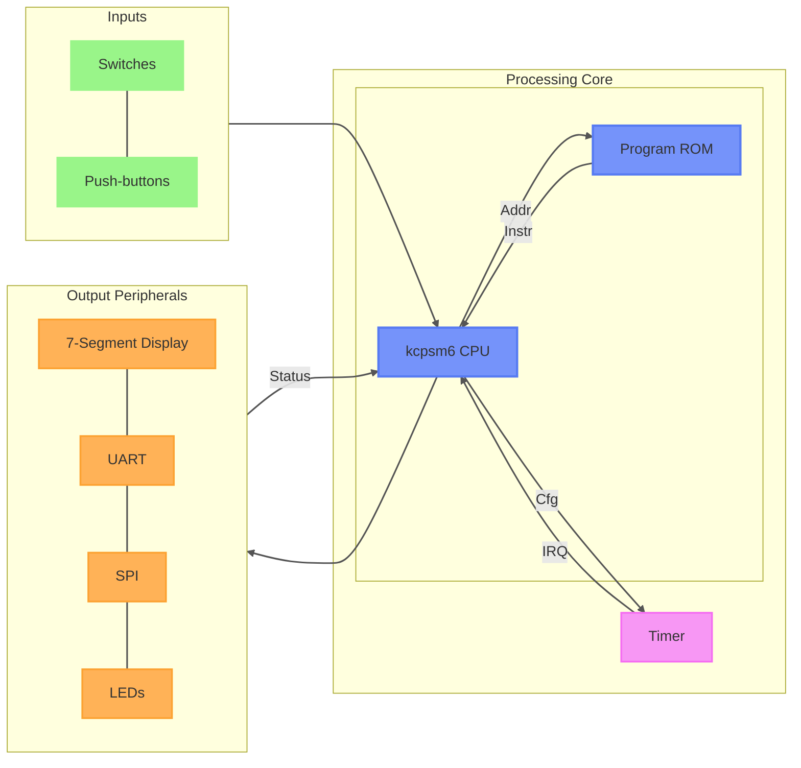

# PicoBlaze FPGA SoC
<!-- Add graph for explain state machine (spi, ...) -->
A small educational System-on-Chip built around the Xilinx PicoBlaze (KCPSM6) soft-core processor on the basys 3 development board.

The project demonstrates how to connect a PicoBlaze CPU to common FPGA peripherals through a memory-mapped I/O interface. It provides examples of:

* GPIO control (LEDs and switches)
* Push-button inputs with debouncing
* UART communication
* 7-segment display control
* SPI master interface
* Timer peripheral with interrupt generation

The design is intended for learning embedded systems concepts on FPGA platforms while keeping the hardware architecture simple and easy to understand.

This project was carried out during an internship at Ulster University in Derry, under the supervision of Jim Harkin.

# Architecture Overview


The PicoBlaze accesses peripherals through its standard 8-bit I/O port interface.

Each peripheral is assigned one or more port addresses.

# Repository Contents

| Module          | Description                       |
| --------------- | --------------------------------- |
| `picoblaze_top` | Top-level integration             |
| `kcpsm6`        | PicoBlaze CPU core                |
| `picoblaze_rom` | Program memory                    |
| `debouncer`     | Push-button debouncing            |
| `uart`          | UART controller                   |
| `seg7`          | 4-digit seven-segment driver      |
| `timer`         | Programmable timer with interrupt |
| `spi`           | SPI master controller             |
| `flag_buf`      | Interrupt flag latch              |

# Clock and Reset

## Clock

The entire system operates from the FPGA system clock.

## Reset Sources

The PicoBlaze reset signal is generated by:

* Center push-button (`btnC`)
* ROM reload signal (`rdl`)

```
reset = btnC_db OR rdl
```

# Interrupt System

The timer peripheral can generate interrupts.

The interrupt request is latched until acknowledged by PicoBlaze.

## Interrupt Vector
The interrupt vector is at the address `0x3FF` (ie: last address of the ROM)

# UART

## Shared design

Both cores (receriver and transmitter) are 4-state FSMs (`idle`, `start`, `data`, `stop`) driven by the same oversampling tick `s_tick` (16 ticks per bit period, generated by the shared baud rate module in `uart.vhd`). An internal counter `s_reg` times out each bit period on this tick, while `n_reg` tracks how many of the `DBIT` data bits have been transferred. This shared structure means both directions of the link follow the same mental model: start bit, N shifted data bits, stop bit.

## Idle and start

The receiver idles watching `rx` for a falling edge, which marks the start bit; the transmitter idles holding `tx` high and waits for `tx_start` to latch a new byte from `din`. In both cases, entering `start` resets `s_reg` and begins timing the start bit for a full 16-tick period, so the receiver's start-bit wait doubles as start-bit generation on the transmit side. The receiver samples at `s_reg = 7` (bit center, for timing tolerance) before moving on, while the transmitter simply drives `tx` low for the full period.

## Data

Each bit takes 16 ticks. The receiver samples `rx` at the tick center and shifts it into `b_reg` (`rx & b_reg(7 downto 1)`), reconstructing the byte as bits arrive. The transmitter does the mirror operation: it drives `tx` from the LSB of `b_reg`, then shifts `b_reg` right to expose the next bit. In both cores, `n_reg` increments per bit and the FSM moves to `stop` once all `DBIT` bits have been handled.

## Stop

Both cores hold the line in its idle state (`rx` timing out, `tx` driven high) for `SB_TICK` ticks to cover 1, 1.5 or 2 stop bits. On completion, a one-cycle pulse (`rx_done_tick` or `tx_done_tick`) signals the byte is ready, and the FSM returns to `idle`.


# SPI

## Idle state

In `idle`, the module waits for a transaction to be started. `sclk` is held at the level set by `CPOL`, and `mosi` is tri-stated. Writing the `ENABLE` bit in `SPI_CONFIG` triggers the start: the frame length is read from `SPI_LEN` (clamped between 1 and 32), the first byte is popped from the TX FIFO, `spi_rw_reg` is initialized from `CPHA`, and the FSM moves to `data`. The `ENABLE` bit is automatically cleared once the transition happens, so it behaves as a one-shot trigger rather than a persistent enable.

## Data state, bit transfer

Inside `data`, a single counter (`counter_reg`) drives all the timing. It increments once per `spi_tick` and doubles as a write/read phase selector through `spi_rw_reg`, which flips every tick. Each bit of the frame takes two ticks to transfer:

* One tick where `mosi` is driven from the MSB of `w_data_reg` and `sclk` toggles.
* One tick where `miso` is sampled into `r_data_reg` and `sclk` toggles again.

Which of the two comes first for a given bit is determined by `CPHA`, since that value seeds `spi_rw_reg` at the start of each byte. This alternation is what produces the setup and sample clock edges required by SPI.

## End of byte

Once `counter_reg` reaches `data_length*2`, `sclk` stops toggling, leaving one quiet tick before the byte is finalized. At `counter_reg = data_length*2+1`, the sampled byte is written to the RX FIFO and `counter_reg` resets to 0. From here there are two possible outcomes:

* If more bytes remain in the frame, the next byte is popped from the TX FIFO, `spi_rw_reg` is reloaded from `CPHA`, and the FSM stays in `data` for another byte.
* If this was the last byte of the frame, `ss_n` is released and the FSM returns to `idle`.

# TIMER

## Idle state

In `idle`, both the main counter (`counter_reg`) and the prescaler (`prescaler_reg`) are held at 0. The FSM leaves this state as soon as the `EN` bit in `TIM0_CFG` is set, moving to `counting`.

## Counting state, prescaling

Inside `counting`, the timer first has to divide down the input clock before the main counter advances. On every clock cycle, `prescaler_reg` is compared against the `PSC` field of `TIM0_CFG`. While it has not reached that value, it simply increments. Once it matches `PSC`, it resets to 0 and the main counter is allowed to advance by one, which is what produces the counter clock frequency of `f_clk / (PSC+1)`.

## Counting state, reaching the preload value

Each time the prescaler rolls over, the main counter is checked against `preload_reg`. If it has not reached it yet, it simply increments. If it has reached it, `counter_reg` is reset to 0 and the behavior depends on the `AR` bit:

* If `AR` is set, the timer keeps running: the counter restarts from 0 on the next prescaled tick, giving a free-running, auto-reloading timer.
* If `AR` is clear, the timer stops itself: the `EN` bit is cleared automatically and the FSM returns to `idle`, giving a one-shot timer.

## Forced stop

At any point in `counting`, clearing `EN` externally sends the FSM back to `idle` immediately, regardless of where the counter or prescaler currently stand.

## Interrupt generation

`interrupt_flag` is purely combinational and is not tied to a state transition. It is asserted for a single clock cycle exactly when three conditions align at once: the counter equals the preload value, the `INT` bit is set, and the prescaler is at its terminal count. This is the same instant the counter would either reset or the timer would stop, so the interrupt always fires right as the counter reaches its target.

# 7-segments display

## Overview

The 7-segment driver is split into two independent parts: `binary_to_bcd`, which converts the 14-bit input value into four BCD digits using a small state machine, and `seg7` itself, which multiplexes those four digits onto the physical display through a free-running clock divider. Only the conversion has real states; the multiplexing is pure combinational and counter logic.

## Binary to BCD

### start state

In `start`, the module checks the incoming binary value against `MAX_VAL` (9999). If the value is within range, it is latched into the working register and the FSM moves to `shift`. If it exceeds `MAX_VAL`, the working register is cleared instead and the FSM jumps directly to `done`, which acts as an overflow guard so the display never shows a corrupted value.

### shift state

`shift` implements the double dabble algorithm. On each pass, every BCD nibble currently greater than 4 is incremented by 3 (combinational correction), and the whole binary/BCD register pair is shifted left by one bit. This is repeated once per bit of the input value (`N` times, 14 in this design). A shift counter tracks how many passes have been done, and once it reaches `N`, the FSM moves to `done`.

### done state

In `done`, the fully converted four-digit BCD result is latched into a separate output register. This keeps the value shown on the display stable while a new conversion starts immediately afterward, since the FSM returns to `start` on the next cycle. One notable detail here is that this FSM is clocked on the falling edge of `clk`, unlike most of the other modules in the design which use the rising edge.

## Display multiplexing (`seg7`)

Once the four BCD digits are available, `seg7` cycles through them fast enough that all four appear lit simultaneously to the eye. A free-running counter increments every clock cycle, and its most significant bit toggles a 2-bit selector. That selector picks which digit's anode is driven active (one-hot, active low) and which BCD value is routed to the segment decoder at that instant. A final combinational block translates the selected BCD nibble into the corresponding 7-segment pattern.

# Peripheral Register Map

## Input Registers (Read)

| Port | Name         | Access | Description                |
| ---- | ------------ | ------ | -------------------------- |
| 0x00 | SW_LOW       | R      | Switches [7:0]             |
| 0x01 | SW_HIGH      | R      | Switches [15:8]            |
| 0x02 | UART_RX_DATA | R      | Received UART byte         |
| 0x03 | UART_STATUS  | R      | UART status flags          |
| 0x04 | TIM0_CNT0    | R      | Timer counter bits [7:0]   |
| 0x05 | TIM0_CNT1    | R      | Timer counter bits [15:8]  |
| 0x06 | TIM0_CNT2    | R      | Timer counter bits [23:16] |
| 0x07 | TIM0_CNT3    | R      | Timer counter bits [31:24] |
| 0x08 | SPI_STATUS   | R      | SPI status flag            |
| 0x09 | SPI_RX_DATA  | R      | Received SPI byte          |
| 0x0A | PB           | R      | Push-button state          |


## Output Registers (Write)

| Port | Name         | Access | Description                     |
| ---- | ------------ | ------ | ------------------------------- |
| 0x00 | LED_LOW      | W      | LEDs [7:0]                      |
| 0x01 | LED_HIGH     | W      | LEDs [15:8]                     |
| 0x02 | UART_TX_DATA | W      | UART transmit byte              |
| 0x03 | SEG7_LOW     | W      | Seven-segment value bits [7:0]  |
| 0x04 | SEG7_HIGH    | W      | Seven-segment value bits [13:8] |
| 0x05 | TIM0_CFG     | W      | Timer configuration register    |
| 0x06 | TIM0_PRE0    | W      | Timer preload bits [7:0]        |
| 0x07 | TIM0_PRE1    | W      | Timer preload bits [15:8]       |
| 0x08 | TIM0_PRE2    | W      | Timer preload bits [23:16]      |
| 0x09 | TIM0_PRE3    | W      | Timer preload bits [31:24]      |
| 0x0A | SPI_CONFIG   | W      | SPI configuration register      |
| 0x0B | SPI_LEN      | W      | SPI frame lenght                |
| 0x0C | SPI_TX_DATA  | W      | SPI transmit byte               |

# Register Description

## UART_STATUS (0x03)

| Bit | Name     | Access | Description        |
| --- | -------- | -------|------------------- |
| 0   | RX_EMPTY | R      | Receive FIFO empty |
| 1   | TX_FULL  | R      | Transmit FIFO full |
| 7:2 | Reserved | R      | Always 0           |

Example:

```assembly
input s0, 03[uart_status_port]
test s0, 01[RX_EMPTY_UART]
jump z, uart_data_available
```

## SPI_STATUS (0x08)

| Bit | Name     | Access | Description              |
| --- | -------- | -------|------------------------- |
| 0   | BUSY     | R      | SPI transfer in progress |
| 1   | TX_FULL  | R      | SPI TX fifo full         |
| 2   | RX_EMPTY | R      | SPI RX fifo empty        |
| 7:3 | Reserved | N/A    | Always 0                 |


## SPI_CONFIG (0x0A)

| Bit | Name     | Access | Description           |
| --- | -------- | -------|---------------------- |
| 0   | ENABLE   | W      | Start SPI transaction |
| 1   | CPOL     | W      | SPI clock polarity    |
| 2   | CPHA     | W      | SPI clock phase       |
| 7:3 | Reserved | W      | Write 0               |

### SPI Modes

| Mode | CPOL | CPHA |
| ---- | ---- | ---- |
| 0    | 0    | 0    |
| 1    | 0    | 1    |
| 2    | 1    | 0    |
| 3    | 1    | 1    |

## SPI_LEN (0x0B)

| Bit | Name     | Access | Description                    |
| --- | -------- | -------|------------------------------- |
| 4:0 | Lenght   | W      | Lenght of SPI frame (in byte)  |
| 7:5 | Reserved | N/A    | Always 0                       |

NB: The lenght is currently cap to 32 to limit the size of fifos. You can increase it in the vhdl of the spi module if necessary.

## SPI_TX_DATA (0x0C)

Write one byte to be transmitted by the SPI master.

```assembly
LOAD s0, A5
OUTPUT s0, 0C[spi_tx_port]
```

## SPI_RX_DATA (0x09)

Contains the byte received during the previous SPI transaction.

```assembly
INPUT s0, 09[spi0_rx_port]
```

## LED_LOW (0x00)

Controls LEDs [7:0].

```assembly
LOAD s0, FF
OUTPUT s0, 00[leds7_0_port]
```

## LED_HIGH (0x01)

Controls LEDs [15:8].

```assembly
LOAD s0, 55
OUTPUT s0, 01[leds15_8_port]
```

## SEG7_LOW (0x03)

Lower 8 bits of the displayed value.


## SEG7_HIGH (0x04)

Upper 6 bits of the displayed value.

The seven-segment driver displays a 14-bit binary value (max value = 9999):


# UART Configuration

Current hardware configuration:

| Parameter  | Value   |
| ---------- | ------- |
| Baudrate   | 115200  |
| Data Bits  | 8       |
| Parity     | None    |
| Stop Bits  | 1       |
| FIFO Depth | 4 bytes |


# SPI Configuration

Current hardware configuration:

| Parameter       | Value        |
| --------------- | ------------ |
| Master Mode     | Yes          |
| Data Length     | 8 bits       |
| Clock Frequency | 1 MHz        |
| CPOL            | Configurable |
| CPHA            | Configurable |

# Timer
<!-- need explain config reg -->
The timer peripheral provides:

* 32-bit free-running counter
* Interrupt generation
* Counter value readable through ports 0x04–0x07

## TIM0_CFG (0x05)

| Bit | Name     | Access | Description                    |
| --- | -------- | -------|------------------------------- |
| 0   | EN       | W      | Enable the timer               |
| 1   | INT      | W      | Enable the interruption        |
| 2   | AR       | W      | Auto relaunch the timer when it reach the preload value |
| 3   | Reserved | N/A    | Always 0 |
| 7:4 | PSC      | W      | Prescaler value. The counter clock frequency is equal to $f_{clk}/(PSC+1)$  |

## TIM0_PRE (0x06-0x09)

| Bit | Name     | Access | Description                    |
| --- | -------- | -------|------------------------------- |
| 31:0| PRE      | W      | Preload value                  |

## TIM0_CNT (0x04-0x07)

| Bit | Name     | Access | Description                    |
| --- | -------- | -------|------------------------------- |
| 31:0| CNT      | R      | Counter value                  | 

Counter layout:

| Port | Counter Bits |
| ---- | ------------ |
| 0x04 | [7:0]        |
| 0x05 | [15:8]       |
| 0x06 | [23:16]      |
| 0x07 | [31:24]      |


# GPIO

## Inputs

### Switches

| Port | Signal   |
| ---- | -------- |
| 0x00 | SW[7:0]  |
| 0x01 | SW[15:8] |

### Push-buttons (0x0A)

| Bit | Signal        |
| --- | ------------- |
| 0   | Button Right  |
| 1   | Button Left   |
| 2   | Button Down   |
| 3   | Button Up     |
| 7:4 | Always 0      |


## Outputs

### LEDs

| Port | Signal    |
| ---- | --------- |
| 0x00 | LED[7:0]  |
| 0x01 | LED[15:8] |

# Building

The project targets a Xilinx FPGA Artix-7 and uses:

* KCPSM6 PicoBlaze processor
* Basys 3 board
* Vivado 2024.2

## PSM compilation
The firmware is written in assembly and compile by the `kcpsm6.exe`, official compiler for the CPU.
The actual firmware is the program name `picoblaze_rom.psm` in the `Softwares` folder. To compile it, you need to move to this folder and type :

```shell
.\kcpsm6.exe .\picoblaze_rom.psm
```
The script will generate a file name `picoblaze_rom.vhd` from the assembly and the ROM template. This file is the vhdl description of the ROM of the projet with the program inside. To flash it into the board, you need to use it on the vivado project.

Copy/replace the `picoblaze_rom.vhd` in `picoblaze.srcs/sources_1/imports/picoblaze/Softwares` by the new one. After that you need to regenerate the bitstream on vivado to take into account the new firmware. When the compilation of the bitstream is finish, connect to the board, program the device. The program will start automatically.

# Example
<!-- explain the actual program -->

# Annexes
* [Picoblaze official page](https://www.amd.com/en/products/adaptive-socs-and-fpgas/intellectual-property/picoblaze.html)
* [Basys 3](https://digilent.com/reference/programmable-logic/basys-3/reference-manual)
* [FPGA exemple](https://blog.aku.edu.tr/ismailkoyuncu/files/2017/04/02_ebook.pdf)